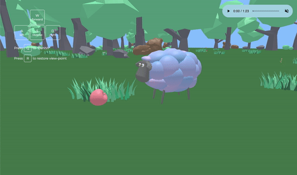

# Sheep

Need a little break from staring at endless lines of code? Tired from coding away all day? Sheep is designed for developers \(or any hard-working individuals\) to take a few minutes of mental break. The lush green backdrop and goofy, meandering flock of sheep will help you find a momentary peace and bring down the speed of the busy day a notch. 

[Go Play Now!](https://dollyshin88.github.io/sheep/)

## Technologies
* Three.js
* JavaScript
* HTML5/CSS3
* Vectary - used for 3D object designing and exporting

## Implementation Details
* The application utilizes Three.js raycaster to detect collision. 
    * If the collided object is another sheep or trees/rocks, the user sheep's movement is blocked. 
    * If the collided object is a food item, the item is consumed \(no longer visible on the screen\).
    * In order to make the collision detection more sensitive \(cast more rays in varying directions\), Icosahedron geometry is used around the sheep rather than a simple cube geometry.
     
    
     
    
    
    
     

* In order to ensure that the sheep faces the direction that it is moving in, the navigation logic accounts for the sheep's position and angle relative to the center of the plane and its own angle of rotation. 
* The flock of sheep's roaming boundaries are set to the edge of the circular plane. They are designed to turn around 180 degrees and walk the other way once they reach the edge.
* A combination of raycaster and event listener is used to enable clicking on a sheep to make it 'bahh.'
    * Raycaster is applied to the user's mouse
    * On a mousedown event, any sheep that is in the path of the mouse's raycaster is detected and performs desired action

## Future Enhancements
* Improved camera navigation and ability to toggle different perspectives
* Additional interactivity, such as collecting items and dialogue display upon approaching certain objects
* Meadow expansion

